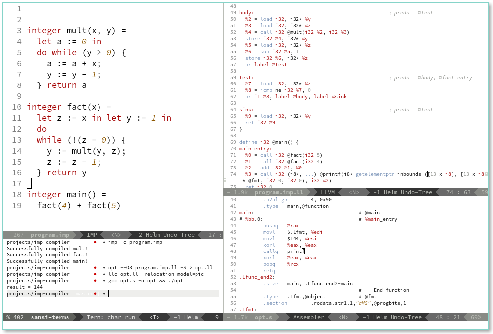

# IMP Compiler
An LLVM-based toy compiler for a variant of "IMP" described in CS311 (Programming Language Design & Implementation). 



## Compilation
In order to compile this, you use the `dune` build system (install dependencies w/ `opam`).
```bash
opam install dune menhir llvm obus ppx_deriving_yojson
cd imp-compiler
dune build
```

## Usage
You can view the options by passing `-h` to the compiler executable.
Currently, there are two options:
- `-p file.imp` - this will attempt to parse the program and print the AST to stdout
- `-c file.imp` - this will attempt compile the program and produce a `file.imp.ll` file in the same directory
- `-s` - this will expose the compiler as a DBus interface (exposing the methods `CompileIMP` and `ParseImp`)

In order to run an IMP program, the program must contain a `main` function w/ 0 arguments (as that compiles directly to `main` that gets called from `libc`'s entry routine):

- You can interpret the programs w/ `lli fileX.ll`.
- You can target an architecture supported by LLVM w/ `llc` (and a target architecture provided by `-march=`, e.g. `llc -march=arm64 program.ll` will produce AArch64 assembly):
```bash
./build/default/src/main.exe -c program.imp
llc program.ll -relocation-model=pic
gcc program.s -o program && ./program
```
Please note the use of `-relocation-model=pic`, this will instruct the compiler to load the format string pc-relative which is required by default on most 64 bit *nix systems.
You can also play around with LLVM's own optimisations w/ `opt`, for example: `opt --O3 program.ll -S` will apply aggressive optimisations (you can list all of the optimisations w/ `opt -h`).

## DBus interface
The compiler has an option `-s` that makes it run as a DBus service, exposing relevant functionality over an interface called `Compiler` (with methods `ParseIMP` and `CompileIMP`). The response from this service is JSON. The interface allows other applications to invoke the compiler with minimal latency, as shown in a demonstration screenshot below:


## TODO:
- Actually handle parsing errors w/ locations.
- Wouldn't be far-fetched to provide debugging information w/ lines corresponding to imperative constructs of the language. Though this would require actually using LLVM's targeting APIs directly.

## Implementation Notes 
- The `new` construct is known as `let` in this language, though, that might change given that both the refer to mutable lvalues.
- All variables are spilled to local `alloca` locations, this is so that all variables are lvalues such that we don't need to insert phi functions in order to merge re-defs of SSA variables at join points. Luckily for us, LLVM's `mem2reg` pass does a really good job of lifting these. The compilation for a function proceeds as you would expect: all parameters are spilled into local "stack" (`alloca`) locations then the body is compiled w/ an environment prepended with the spilled locations (all read/writes of named variables compiled to load/stores, respectively). The compilation of `let` follows  a similar scheme.
- There's no `if` without `else`.
- There's probably bugs. 
